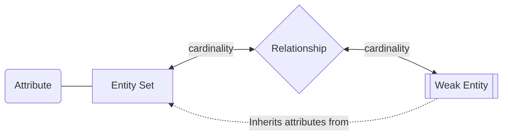
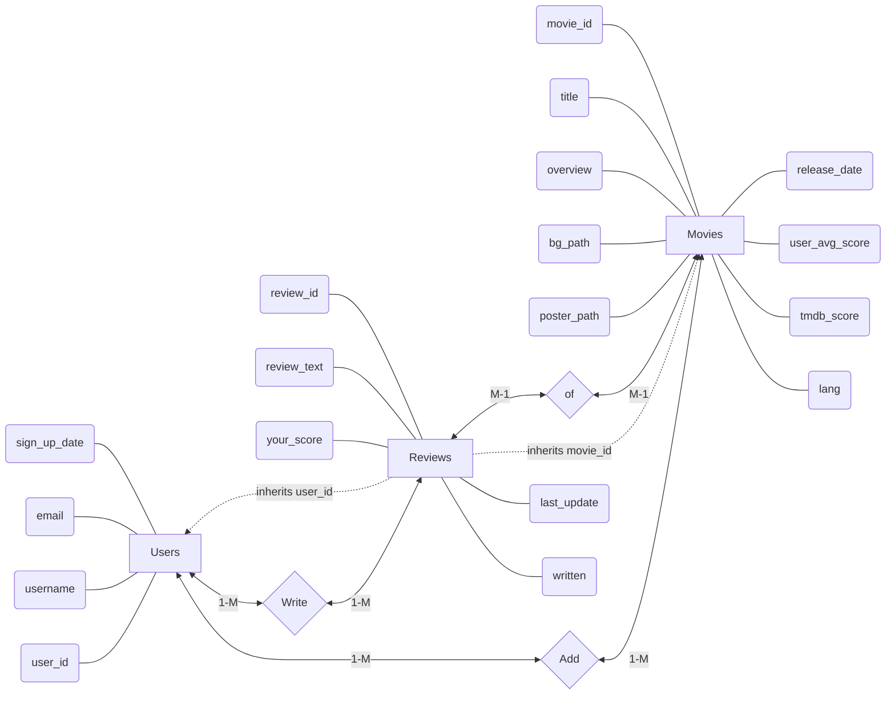

# Database Design

- Author: Caleb Bronn
- Last Update: 15 Mar 2025

## Schema

### Users

| Column | Data Type | Purpose |
|:-:|:-:|:-:|
| user_id | 6-digit number | Uniquely identifies the user |
| username | string | Unique username |
| password | string | Security check for user account |
| sign_up_date | date(YYYY-MM-DD) | Date the user signed up |

#### SQL Table Creation

```
CREATE TABLE Users (
	user_id CHAR(6) NOT NULL PRIMARY KEY,
	username VARCHAR(30) UNIQUE NOT NULL,
	password VARCHAR(100) NOT NULL,
	sign_up_date DATE DEFAULT CURRENT_DATE
);
```

### Movies

| Column | Data Type | Purpose |
|:-:|:-:|:-:|
| movie_id | integer | Uniquely identifies the movie based on its TMDB ID |
| title | string | Movie title |
| overview | string | Description of the movie |
| lang | 2-digit language code | Identifies the original language of the film |
| bg_path | relative path to the background image | Background image of the film |
| poster_path | relative path to the poster image | Poster image of the film |
| tmdb_score | Decimal score out of 10 | Average score on TMDB |
| user_avg_score | Decimal score out of 10 | Average score on this app |
| release_date | date(YYYY-MM-DD) | Date the film was released |

#### SQL Table Creation

```
CREATE TABLE Movies (
    -- TMDB movie IDs are integers
	movie_id INT NOT NULL PRIMARY KEY,
	-- longest movie title ever is 213 chars long
	title VARCHAR(213),
	-- 4,000 chars is the max length for varchar
	overview VARCHAR(4000),		
	-- 2-letter language code
	lang CHAR(2),
	-- path for movie background image
	bg_path VARCHAR(100),
	-- path for movie poster image
	poster_path VARCHAR(100),	
	-- scores are stored as decimal percentages on TMDB
	tmdb_score NUMBER(4, 2) CHECK(tmdb_score <= 10.00 AND tmdb_score >=0.0),
	-- average score from users on this app
	user_avg_score NUMBER(4, 2) CHECK(user_avg_score <= 10.00 AND user_avg_score>=0.0),
	release_date DATE
);
```

### Reviews

| Column | Data Type | Purpose |
|:-:|:-:|:-:|
| review_id | 9-digit number | Uniquely identifies the review |
| user_id | 6-digit number | Identifies the user who wrote the review |
| movie_id | integer | Identifies the movie the review is for |
| review_text | string | Review text submitted by user |
| your_score | Decimal score out of 10 | Score submitted by user |
| written | date(YYYY-MM-DD) | Date the review was written |
| last_update | date(YYYY-MM-DD) | Date the review was last updated |

#### SQL Table Creation

```
CREATE TABLE Reviews (
	review_id CHAR(9) NOT NULL PRIMARY KEY,
	user_id CHAR(6),
	movie_id INT,
	--4,000 chars is the max length for varchar
	review_text VARCHAR(4000) NOT NULL, 
	your_score NUMBER(4, 2) CHECK(your_score <= 10.00),
	written DATE DEFAULT CURRENT_DATE,
	-- same as 'written' if review has never been updated
	last_update DATE,					
	FOREIGN KEY (user_id) REFERENCES Users(user_id),
	FOREIGN KEY (movie_id) REFERENCES Movies(movie_id)
);
```

## Entity-Relationship Diagram

This diagram displays the attributes and relationships between each table in the database.

### Legend



### ERD


